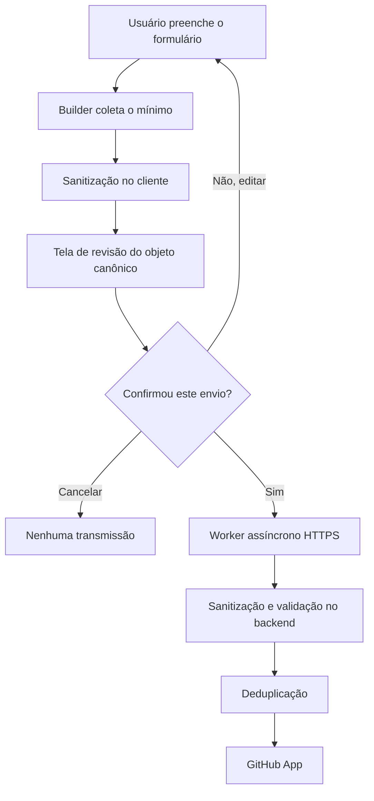
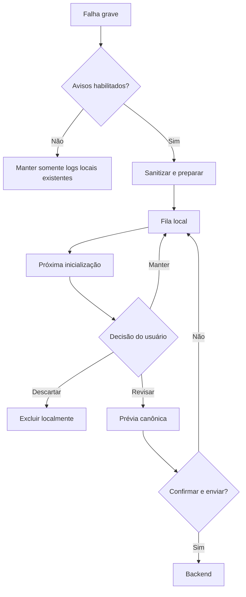

# Relatórios de problemas

O recurso **Relatar problema** permite que uma pessoa descreva uma falha sem
conhecer GitHub ou possuir uma conta. A regra inviolável é que detectar ou
preparar um relatório nunca autoriza transmiti-lo. Cada tentativa de envio
exige revisão completa e um clique explícito em **Confirmar e enviar**.

## Fluxos e interface

No fluxo manual, o formulário solicita categoria, descrição, comportamento
esperado e frequência. IDs estáveis em inglês compõem o documento; rótulos
traduzidos existem apenas na interface. Sistema, erro e logs sanitizados podem
ser removidos antes da revisão. **Revisar relatório** não grava nem envia.

Na revisão, o aplicativo mostra o objeto canônico completo, o destino
`rafatosta/zapzap`, a possibilidade de issue pública, a ausência de exigência
de conta GitHub e a lista de informações nunca enviadas. **Voltar e editar**
preserva o formulário. Cancelar fecha sem efeito. Somente **Confirmar e enviar**
salva a tentativa e cria um consentimento de uso único vinculado aos bytes do
documento mostrado.



Para exceções Python não tratadas, `CrashDumpHandler` continua mantendo os
arquivos técnicos locais existentes e pede a `CrashReportCapture` que monte um
JSON sanitizado somente quando `reporting/crash_prompts` estiver habilitada. A
captura também cobre `threading.excepthook`. Ela não abre confirmação durante o
estado instável e não possui dependência do transmissor. Um marcador de sessão
removido somente no encerramento limpo permite que a próxima execução também
reconheça aborts nativos, `SIGKILL` e quedas do processo que não chegaram ao
hook Python; perda de energia pode aparecer conservadoramente como encerramento
inesperado.



## Dados e privacidade

Podem ser incluídos: versão do ZapZap, tipo de instalação, sistema,
arquitetura, desktop/sessão, versões Python/Qt/PyQt, categoria e texto do
relato, tipo/mensagem/traceback sanitizado do erro e trecho limitado de log
sanitizado. A coleta não cria identificador persistente de usuário e não mede
uso ou comportamento.

Nunca entram no payload cookies, headers de autorização, localStorage,
sessionStorage, conteúdo de conversas, mensagens, contatos, credenciais ou
variáveis de ambiente fora da allowlist de desktop/sessão. O sanitizador mascara
e-mails, telefones, IDs de chat, UUIDs, tokens conhecidos, homes em paths,
credenciais e parâmetros sensíveis de URL. O backend repete a sanitização;
logs operacionais registram apenas falha de processamento, nunca o payload.

## Documento, armazenamento e transparência

`ReportDocument` congela o mapping e é a única representação aceita pelo
submitter. A prévia e o corpo HTTP chamam `payload()`/`to_json()` nesse mesmo
objeto; `ExplicitSubmissionConsent` guarda o JSON revisado, é de uso único e
falha se documento e consentimento divergirem.

`LocalReportStore` escreve JSON atomicamente no diretório de dados local. A
fila mantém no máximo 20 relatórios por 30 dias, com estados
`pending_review`, `sending`, `send_failed` e `sent`. Não há retry por timer,
startup ou preferência. Uma falha remota troca o estado para `send_failed` e
mantém o documento para nova ação do usuário.

## Fingerprint e política de issues

Crashes recebem SHA-256 de tipo do erro, componente e até cinco frames
normalizados, sem mensagem ou path completo. O backend usa esse fingerprint
como chave. Sem fingerprint, relatos manuais usam hash de categoria, descrição
e expectativa já sanitizadas. Uma chave existente incrementa ocorrências e
comenta a issue associada; não cria uma issue por ocorrência. Um relato novo
cria issue, enquanto payload inválido é rejeitado antes da integração.

## Backend e deploy

O serviço FastAPI expõe `POST /api/v1/reports` e `/health`, limita o corpo a
128 KiB e cada endereço a dez pedidos por hora. SQLite guarda grupos,
contagens e números de issue. Em produção, use volume persistente, TLS no proxy
e configure apenas no servidor:

```text
GITHUB_APP_ID
GITHUB_APP_INSTALLATION_ID
GITHUB_APP_PRIVATE_KEY
GITHUB_REPOSITORY=rafatosta/zapzap
REPORT_DATABASE=/data/reports.sqlite3
```

A GitHub App precisa somente de `Metadata: read` e `Issues: read/write`. Gere a
imagem com `docker build -f backend/Dockerfile -t zapzap-report-service .`,
publique-a atrás de `https://reports.rtosta.com` e mantenha backups/rotação do
volume. A chave privada nunca deve entrar na imagem, repositório, cliente ou
logs. Configure timeout e limite de corpo também no proxy.

## Testes

`test_reporting.py` cobre sanitização, minimização opcional, fila/TTL, captura
local e consentimento. `test_reporting_ui.py` prova que revisar, voltar e
cancelar não enviam e que o exato objeto exibido chega ao submitter.
`tests/backend/test_report_backend.py` valida a segunda sanitização e
deduplicação sem acessar GitHub. A UI `offscreen` não comprova aparência, foco
do compositor ou latência real; execute ainda o roteiro completo em sessão
gráfica e simule sucesso, timeout, HTTP 429/413/422/503 e indisponibilidade.
