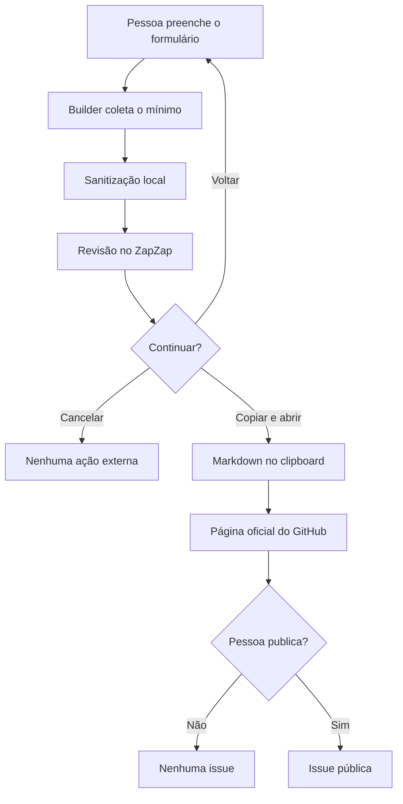
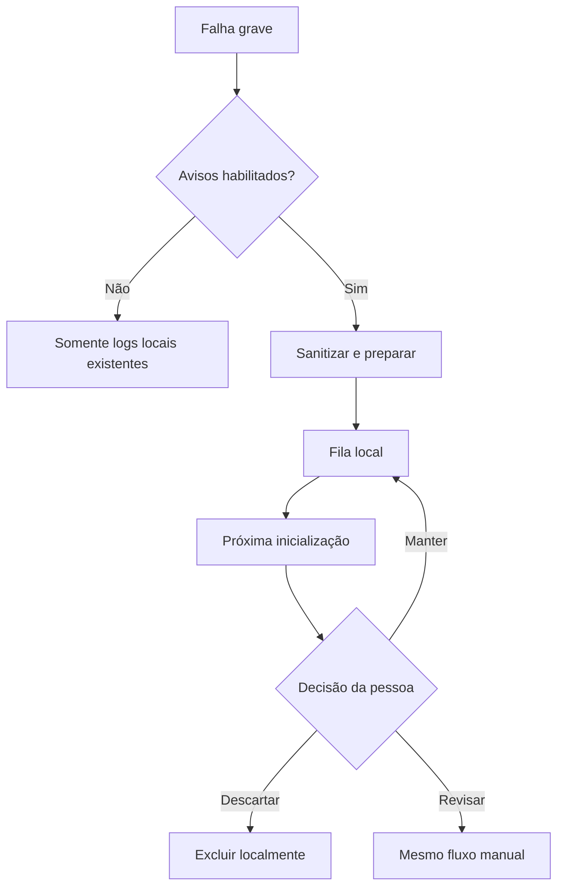

# Relatórios de problemas

O recurso **Relatar problema** prepara localmente um relatório sanitizado para
ser publicado pela própria pessoa no repositório oficial do ZapZap. O
aplicativo não possui cliente de envio, endpoint, credencial do GitHub nem
backend de relatórios. Uma conta GitHub é necessária para publicar a issue.

## Fluxo manual

O formulário solicita categoria, descrição, comportamento esperado e
frequência. IDs estáveis em inglês compõem o documento; rótulos traduzidos
existem apenas na interface. Sistema, erro e logs sanitizados podem ser
removidos antes da revisão. **Revisar relatório** não grava, copia, abre o
navegador nem transmite dados.

Na revisão, o ZapZap mostra um resumo simples e permite abrir o Markdown final
completo. O destino `rafatosta/zapzap`, a visibilidade pública e a necessidade
de conta GitHub ficam explícitos. **Voltar e editar** preserva o formulário.

Somente **Copiar relatório e abrir GitHub** salva o documento localmente, copia
o Markdown para o clipboard e abre a página oficial de nova issue com apenas o
título na query string. Logs, descrições e detalhes técnicos nunca são
colocados na URL. A pessoa cola o conteúdo, pode revisá-lo ou editá-lo novamente
e decide se publica a issue dentro do GitHub.

A tela de revisão informa explicitamente que o corpo não será preenchido pelo
navegador: depois que o GitHub abrir, é necessário colar no campo de descrição
o relatório mantido no clipboard.

## Encerramentos inesperados

Para exceções Python não tratadas, `CrashDumpHandler` continua mantendo os
arquivos técnicos locais existentes e pede a `CrashReportCapture` que monte um
JSON sanitizado somente quando `reporting/crash_prompts` estiver habilitada. A
captura também cobre `threading.excepthook` e não abre UI durante o estado
instável.

Um marcador de sessão removido somente no encerramento limpo permite que a
próxima execução reconheça também aborts nativos, `SIGKILL` e quedas que não
chegaram ao hook Python. Perda de energia pode aparecer conservadoramente como
encerramento inesperado. Na próxima inicialização, a pessoa pode manter,
descartar ou revisar o relatório; nenhuma dessas ações publica conteúdo.

## Dados e privacidade

Podem entrar no Markdown, quando selecionados: versão do ZapZap, tipo de
instalação, sistema, arquitetura, desktop/sessão, versões Python/Qt/PyQt,
categoria, relato, tipo/mensagem/traceback do erro e trecho limitado de log.

Nunca entram cookies, headers de autorização, localStorage, sessionStorage,
conteúdo de conversas, contatos, credenciais ou ambiente completo. O
sanitizador mascara e-mails, telefones, IDs de chat, UUIDs, tokens conhecidos,
homes em paths e parâmetros sensíveis de URL. O ZapZap alerta para não escrever
informações pessoais e a pessoa vê o conteúdo completo antes de copiá-lo.

O clipboard passa a conter o relatório apenas depois da ação explícita. O
ZapZap não consegue controlar quanto tempo outro gerenciador de clipboard o
retém; por isso, o histórico local e a revisão continuam usando somente o
documento sanitizado.

## Documento e armazenamento local

`ReportDocument` congela o mapping sanitizado. A prévia completa e o clipboard
são derivados do mesmo objeto por `ReportMarkdownFormatter`, evitando duas
representações independentes. `GitHubReportLauncher` usa uma URL HTTPS fixa do
repositório oficial e adiciona somente o título sanitizado. No Linux, a abertura
chama `xdg-open` diretamente; nas demais plataformas usa a integração Qt. O
navegador padrão do Python permanece como último fallback.

`LocalReportStore` escreve JSON atomicamente no diretório de dados local e
mantém no máximo 20 relatórios por 30 dias. Os estados observáveis são
`pending` (salvo localmente), `pending_review`, `copied` e
`opened_on_github`; o último significa apenas que a página foi aberta, não que
uma issue foi publicada. Não há rede, retry, token, rate limit próprio ou
deduplicação automática. O GitHub permanece responsável pela autenticação e
publicação.

## Testes

`test_reporting.py` cobre sanitização, minimização, Markdown, fila/TTL e captura
local. `test_reporting_ui.py` prova que revisar, voltar e cancelar não abrem o
GitHub; confirma que a ação final copia exatamente o Markdown revisado; e
verifica que somente o título entra na URL. Nenhum teste acessa GitHub real.

A UI `offscreen` não comprova aparência, foco do compositor, integração com o
navegador ou comportamento do gerenciador de clipboard. Antes de publicar,
execute o fluxo completo em sessão gráfica real e confirme login, colagem,
cancelamento no GitHub e URLs longas em cada plataforma mantida.
